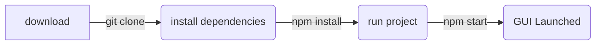

## Mathalous's Portfolio

Run instructions

This project was bootstrapped with [Create React App](https://github.com/facebook/create-react-app) using --template typescript.

This project primarily uses the libraries React, Typescript, and 
react-grid-layout

It was created for showcasing my past projects as well as furthering my frontend development abilities.

It was created with a few self imposed limitations, mainly the seperation of config data and custom views.
